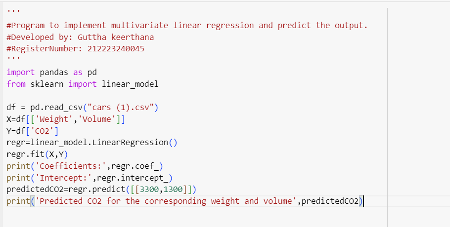

# Implementation of Multivariate Linear Regression
## Aim
To write a python program to implement multivariate linear regression and predict the output.
## Equipment’s required:
1.	Hardware – PCs
2.	Anaconda – Python 3.7 Installation / Moodle-Code Runner
## Algorithm:
### Step1
Import pandas

### Step2
Import linear_model

### Step3
Read the csv file

### Step4
Enter the parameters to implement

### Step5
Run the program 

## Program:

## Output:

## Result
Thus the multivariate linear regression is implemented and predicted the output using python program.